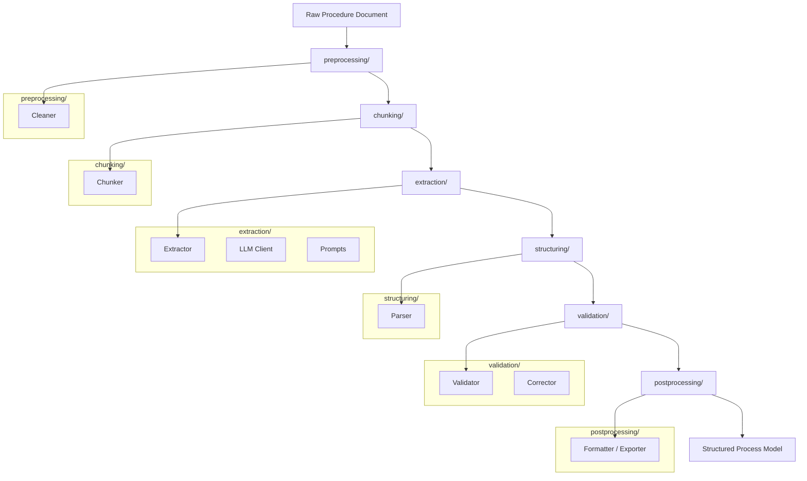

# FlowIQ

Process intelligence pipeline for extracting structured process models from standard operating procedures and similar documents.



```mermaid
flowchart LR

    subgraph Pipeline
        P[pipeline.py]
    end

    subgraph Preprocessing
        Clean[Cleaner]
    end

    subgraph Chunking
        Chunker[Chunker]
    end

    subgraph Extraction
        Extractor[Extractor]
        LLM[LLM Client]
        Prompts[Prompts]
    end

    subgraph Structuring
        Parser[Parser]
    end

    subgraph Validation
        Validator[Validator]
        Corrector[Corrector]
    end

    subgraph Postprocessing
        Formatter[Formatter / Exporter]
    end

    subgraph Utils
        Utils[Utility Functions]
    end

    subgraph Config
        Config[Configuration Files]
    end

    %% Relationships
    P --> Clean
    P --> Chunker
    P --> Extractor
    P --> Parser
    P --> Validator
    P --> Formatter

    Extractor --> LLM
    Extractor --> Prompts

    Clean --> Utils
    Chunker --> Utils
    Extractor --> Utils
    Parser --> Utils
    Validator --> Utils
    Formatter --> Utils

    P --> Config

```
