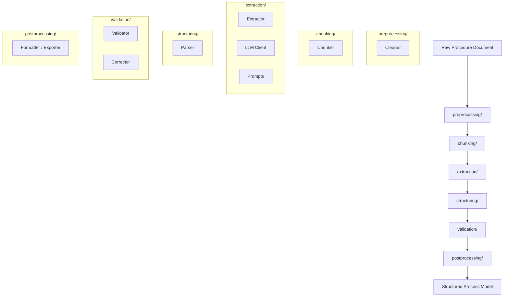

# FlowIQ

Process intelligence pipeline for extracting structured process models from standard operating procedures and similar documents.

```mermaid
flowchart TD
    A[Raw Procedure Document] --> B[preprocessing/]
    B --> C[chunking/]
    C --> D[extraction/]
    D --> E[structuring/]
    E --> F[validation/]
    F --> G[postprocessing/]
    G --> H[Structured Process Model]

    %% Proprocessing
    subgraph preprocessing/
        B1[Cleaner]
    end

    %% Chunking
    subgraph chunking/
        C1[Chunker]
    end

    %% Extraction
    subgraph extraction/
        D1[Extractor]
        D2[LLM Client]
        D3[Prompts]
    end

    %% Structuring
    subgraph structuring/
        E1[Parser]
    end

    %% Validation
    subgraph validation/
        F1[Validator]
        F2[Corrector]
    end

    %% Postprocessing
    subgraph postprocessing/
        G1[Formatter / Exporter]
    end
```